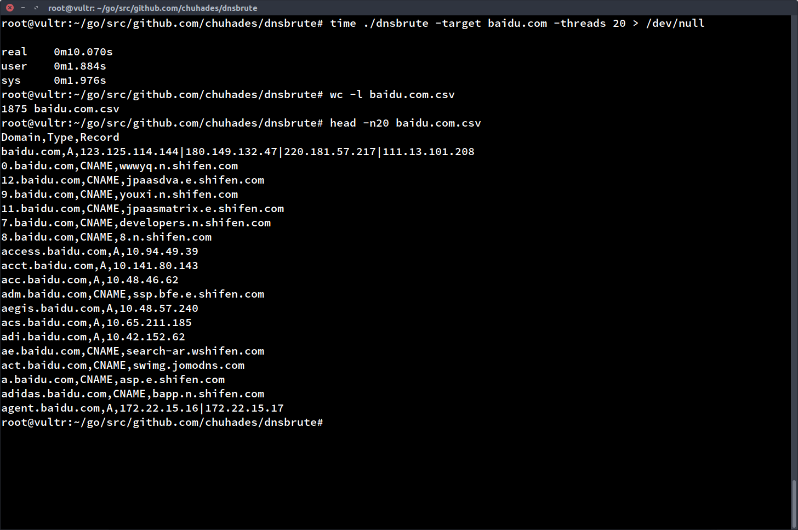

## DNSBrute

#### Feature
- query over api
    - http://www.hackertarget.com/
    - http://ptrarchive.com/
    - ...

- dict based

#### Advantage
- very very very fast
    - DNS Server in Intranet: ~10000 domains /sec
    - Public DNS Server: 4000-5000 domains /sec

#### Screenshot

